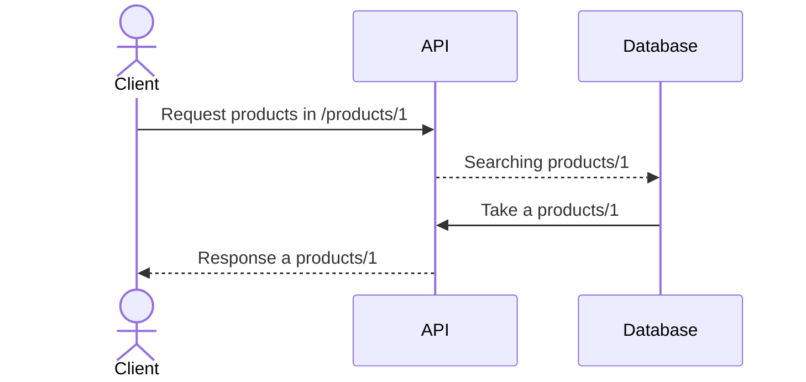

Fala ae. 

Voltando aqui para informar que estou aplicando os meus estudos em uma **API criada em Flask.**

Estou aprendendo em como criar essa api nesse framework que parece ser simples de criar novas páginas para website ou até uma api restful.

Em paralelo estou vendo algumas aulas de **python orientado a objetos** onde vai me ajudar a entender alguns projetos grandes e também melhorar a organização dos códigos.

Quero aplicar alguns conceitos de CI/CD utilizando algumas ferramentas como **Gitlab, docker, kubernetes (k3d local), helm, testes unitários e correções de segurança**.

Penso que o fluxo incial será dessa forma

Mais tarde coloco o progresso desses estudos por aqui.

